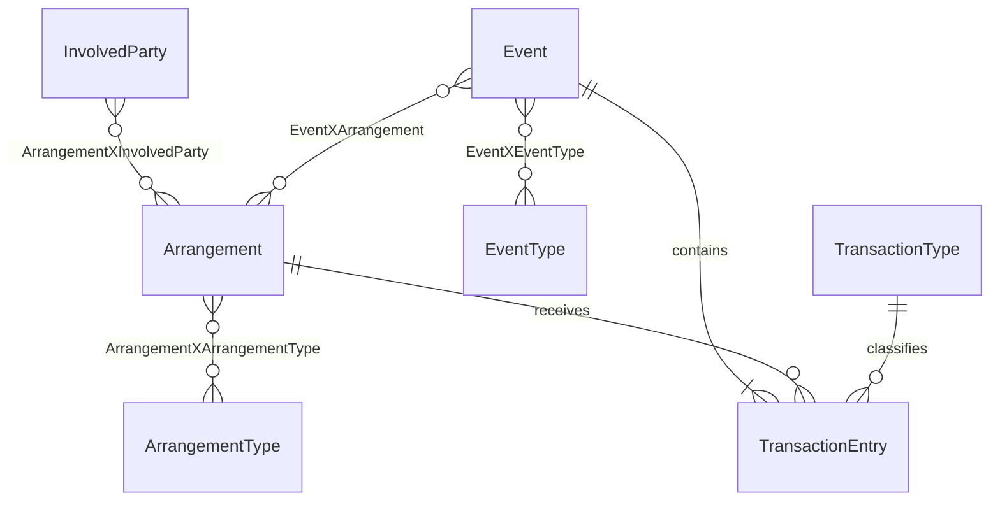

# Wallet Master and FSDM transactions

Wallet Master registers the `Wallet Master` ActivityMaster system. A wallet is an
existing `Arrangement` related to one or more `InvolvedParty` rows through
`ArrangementXInvolvedParty`, with a reviewed `ArrangementType` of `Wallet` through
`ArrangementXArrangementType`. Several wallet arrangements may involve the same
party. The arrangement remains the source of ownership, enterprise, lifecycle,
security token, and business relationships. A party ID alone never grants access.

`WalletSystemInstall` runs automatically through `ISystemUpdate` at sort order
`1200`. It idempotently creates the Wallet and Wallet Clearing arrangement types,
the Transaction Event type, debit/credit transaction types, and wallet action and
summary-metric classifications for each enterprise. It uses ActivityMaster's
existing global data concept; core provisions that concept before this update.
Core also provisions the `Transaction`, `TransactionType`, and
all transaction relationship data concepts used by the warehouse model.
Transfer, deposit, withdrawal and reversal are Event classifications under
`WalletAction`. `WalletBalance` and `WalletTransactionCount` are definitions for
derived Arrangement projections; the installer does not write projection values.
Existing Products can be related through `TransactionXProduct`; wallet setup
does not create catalog products or product types.
Apply the managed `16.transactions.sql` migration before running enterprise updates.
Debit and credit `TransactionType` rows are EntityAssist warehouse entities.
Posted `Transaction` rows and their `TransactionXTransactionType` links are also
ActivityMaster warehouse entities with security rows, all under the same
caller-owned stateless transaction.

Transactions have classified links to involved parties (posting actor, payer,
payee, cashier), resource items (till/POS device), arrangements (accounting wallet,
purchase agreement), products, events, addresses, geography, rules,
classifications and other transactions. Every link has warehouse metadata and
its own security table. There is no separate posting entity: entries carry the
retry key and belong directly to the parent Event. Posting creates the actor,
accounting arrangement and parent Event links; consuming flows add other roles.

## FSDM transaction model

An existing `Event` records a transfer, deposit, withdrawal, correction or other
economic action. `EventType` / `EventXEventType` classifies it; `EventXArrangement`
relates it to affected arrangements. The `transactions` schema records the low
level entries: each entry belongs to that Event and one Arrangement. Multiple
entries per Event can debit and credit different arrangements. `TransactionType`
classifies the entry's accounting effect and is separate from the EventType's
business meaning.

See [the transaction contract](../core/docs/transactions.md) for posting rules,
authorization and migration details. The implementation is
`com.guicedee.activitymaster.fsdm.transactions.TransactionService`.

The entries are the authoritative movement history. Arrangement classifications
may hold balance, amount available, transaction count and similar summary
metrics, but they are projections derived from committed entries. A stale summary
must never authorize a debit. The current classification `Value` field is text;
the exact metric concepts, units and refresh policy need to be defined with the
accounting rules. No old Wallet-specific `wallet.account` or `wallet.entry`
tables are part of this model.

## Security and host integration

Wallet operations require both the current ActivityMaster arrangement/party
security and the reviewed wallet plugin behavior for the selected Realm/context.
The host verifies its caller and actor assertion, enforces replay protection,
resolves the authenticated account to an involved party and supplies the actor.
System discovery is not permission to use the wallet.
Wallet Master contributes its own REST endpoints, GraphQL queries/mutations and
`IWalletService` Guice binding. The consuming module owns authentication and UI
and binds `WalletIdentityProvider` to its verified request context. The default
provider denies access. Wallet Master accepts only a server-resolved actor and
uses the caller's stateless session. Read-only discovery connections are not
used for wallet writes.
Provider installations and behavior grants use secured FSDM Events; wallet
operations resolve those current FSDM records on each call.

Migrations are managed separately. The schema must resolve against the existing
canonical FSDM tables; it must not create substitute Arrangement, Event, Party,
or security structures. See [the standalone API and host integration contract](docs/api.md) for routes,
GraphQL operations, required grants and integration tests. Live host authentication
wiring and production activation remain host deployment work.
