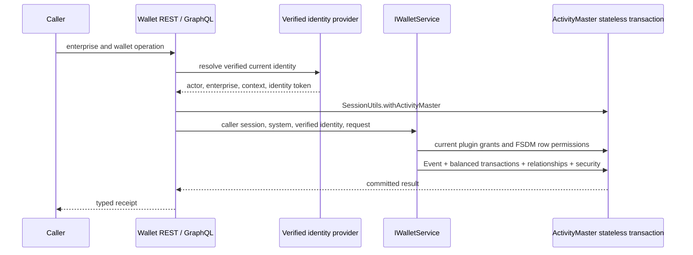

# Standalone Wallet Master API

Wallet Master contributes its own Guice service binder, REST resource and GraphQL
schema provider, following Cerial Master. The consuming host owns authentication and binds
`WalletIdentityProvider` to resolve its current verified actor, enterprise,
Realm/context and ActivityMaster identity token. The default provider denies
access. These values never come from a wallet request body or GraphQL argument.



Public operations create ordinary wallets, read balances and bounded history,
and transfer, deposit or withdraw value. Clearing arrangements are provisioned
by the host's authorized domain flow; a deposit never mints a balance without a
clearing debit. All movements require access to both arrangements. Personal and
Social operations retain the existing participant restrictions; Work operations
remain enterprise-scoped. Monetary amounts use decimal strings over both APIs.

Operation keys derive stable Event IDs. An advisory transaction lock serializes
creation and retries before an Event exists. The persisted action and line data
must match a retry; current grants and row permissions are checked again. Reads
and mutations use the same authorization service. No callback is detached from
the transaction, and failures roll back security and relationship writes too.

The module does not authenticate users, parse identity tokens supplied in request
bodies, or create plugin grants implicitly. A consuming host must install and
enable the wallet provider and grant its reviewed behaviors and FSDM permissions.
Wallet and payment admission reads secured FSDM Events and classified relationships;
Installation Events use the
`<Wallet SystemID>:Scoped Provider Installation` type and classify the exact
provider, Realm and owner. Explicit grant Events use the
`<Wallet SystemID>:Scoped Behavior Grant` type, the same scope classifications,
a `<Wallet SystemID>:wallet.*` behavior value and an involved-party actor link.
The host provisions these through an authenticated, authorized FSDM write flow,
including actor read permission on both Events. It revokes access by ending the
installation/grant Event or actor link's effective period. Current grants are
checked on every call, including retries.

## Host integration

Bind the provider in the consuming application's Guice module:

```java
bind(WalletIdentityProvider.class).to(HostWalletIdentityProvider.class);
```

Its `current()` method must return a fresh immutable `WalletIdentity` from the
host's verified request context: involved party, enterprise, Realm/context,
ActivityMaster identifying token, and reviewed provider ID. The identifying
token is the credential used by ActivityMaster's token resolver, **not** the
`SecurityTokenID` database primary key and not a Keycloak bearer string.
The four-argument identity constructor defaults the provider ID to `wallet`;
use the five-argument constructor for a separately reviewed provider per system
or enterprise. Wallet validates that the provider maps to its enterprise's
Wallet Master system. Do not retain a caller identity in a shared singleton.

Grant the provider-qualified behaviors `wallet.create`, `wallet.read`,
`wallet.post`, `wallet.transfer`, `wallet.deposit`, and `wallet.withdrawal` as
appropriate. Movements require `wallet.post` and the specific action. The
current actor must be readable with the verified identity token; both source
and destination arrangements must be writable for a movement. New wallets and
Events receive restricted row security plus an explicit grant for that identity.
Transaction rows and their links receive restricted security and an identity
read grant. Provision clearing arrangements through an authorized host flow.

## REST and GraphQL

Paths below are relative to the host's configured REST base:

| REST operation | GraphQL operation |
|---|---|
| `POST /{enterprise}/wallet/accounts` | `walletCreate` mutation |
| `GET /{enterprise}/wallet/accounts/{id}/balance?unit=POINTS` | `walletBalance` query |
| `GET /{enterprise}/wallet/accounts/{id}/transactions?unit=POINTS&offset=0&limit=50` | `walletHistory` query |
| `POST /{enterprise}/wallet/transfers` | `walletTransfer` mutation |
| `POST /{enterprise}/wallet/deposits` | `walletDeposit` mutation |
| `POST /{enterprise}/wallet/withdrawals` | `walletWithdraw` mutation |

Create accepts `{ "operationKey": "<uuid>" }`. Movement bodies use:

```json
{
  "operationKey": "<unique-retry-uuid>",
  "sourceId": "<source-arrangement-uuid>",
  "destinationId": "<destination-arrangement-uuid>",
  "amount": "12.50",
  "unit": "POINTS"
}
```

GraphQL mutations take `enterprise: String!` and an `input` with the same fields.
Balance/history queries take `enterprise`, `walletId`, and `unit`. History
additionally accepts `offset` and `limit` (1..100). Amounts are decimal strings
in requests and responses. REST denies authorization with 403, malformed service
requests with 400, and operation conflicts/insufficient funds with 409.

`IWalletService<?>` can also be injected into a Java consumer. Its methods accept
the caller's stateless session, Wallet Master system, and verified identity;
the caller must own the transaction. The REST/GraphQL `WalletApi` entry point
uses `SessionUtils.withActivityMaster` and returns only after commit.

## Verification

`WalletIntegrationTest` reuses ActivityMaster's PostgreSQL test harness and
executes the production EntityAssist service, security checks, REST resource
methods, and executable GraphQL schema. It covers deposits, transfers,
withdrawals, balances/history, conflicting and concurrent retries, concurrent
spending, rollback, grant revocation, row denial, missing authentication, and
wrong enterprises. It does not claim a live host authentication deployment.

```powershell
mvn '-DFSDM_DBSERVER=127.0.0.1' '-DFSDM_PASSWORD=fixture-password' '-DFSDM_SSL_MODE=disable' '-DENVIRONMENT=test' '-Dtest=WalletIntegrationTest' '-Dmaven.test.failure.ignore=false' test
```

The shared GraphQL assembler creates missing operation roots for contributed
extensions, so wallet contributes `extend type Mutation` without redefining
another module's root. The GuicedEE GraphQL HTTP test covers that composition.
